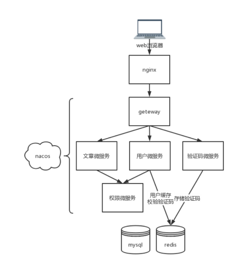

# 个人博客

[项目地址](http://43.143.70.32)

email: 123@qq.com|456@qq.com|789@qq.com

password: 123456

## 整体架构

## 前端

## 后端

### 用户微服务 BLOG-USER-SERVICE

#### 用户表

| colum        | type             | memo     |
|--------------|------------------|----------|
| id           | bigint unsigned  | 主键id     |
| email        | varchar          | 唯一、登录认证  |
| password     | varchar          | 密码       |
| nickname     | varchar          | 昵称、可以重复  |
| sex          | varchar          | 性别       |
| secret       | varchar          | jwt的加密信息 |
| gmt_modified | datetime         | 上次修改     |
| gmt_created  | datetime         | 创建时间     |
| is_deleted   | tinyint unsigned | 是否注销     |

#### 全局参数校验

- Required 必需的参数，不能为空
- Length 参数的长度，必须为String类型
- Type 正则表达式，有常量类，包含了需要的正则

#### 用户的注册、登录

##### 注册

使用邮箱、密码、确认密码和验证码注册，注册完直接生成token不用登录

#### 登录

使用邮箱+密码或者邮箱+验证码即可登录，登录后生成token

### 文章微服务 BLOG-ARTICLE-SERVICE

- 博文的增删改查
- 博文的信息包括多个标签、一个分类、(TODO 信息、阅读量、点赞数)

#### 文章表

blog_article

| column          | type             | memo         |
|-----------------|------------------|--------------|
| id              | bigint unsigned  | 主键id         |
| user_id         | bigint unsigned  | 作者(用户id)     |
| title           | varchar(32)      | 标题           |
| article_kind_id | tinyint unsigned | 类型id         |
| article_body_id | bigint unsigned  | 文章id         |
| gmt_created     | datetime         | 创建时间         |
| gmt_modified    | datetime         | 修改时间         |
| is_deleted      | tinyint unsigned | 是否删除         |

blog_article_body

| column  | type            | memo |
|---------|-----------------|------|
| id      | bigint unsigned |      |
| content | text            |      |

blog_article_tag

| column     | type            | memo |
|------------|-----------------|------|
| id         | bigint unsigned |      |
| article_id | bigint unsigned |      |
| tag        | varchar(32)     |      |

blog_article_kind

| column | type            | memo |
|--------|-----------------|------|
| id     | bigint unsigned |      |
| kind   | text            |      |

### 权限认证微服务 BLOG-AUTHORITY-SERVICE

- 作为其他微服务的api
- 调用者通过token获得请求的User，存放在自己的ThreadLocal中
- 调用者根据user生成token，生成过程中会刷新token

### 网关微服务 BLOG-GATEWAY-SERVICE

转发到其他微服务

### 验证码微服务 BLOG-CAPTCHA-SERVICE

- 生成验证码存储在Redis中
- 从Redis中取出验证码

### 公共模块 BLOG-COMMON

只用spring.factories启动类启动，并且配置了相关的enabled

- 全局的参数校验
- 全局的异常处理
- 封装了通用的RedisService

